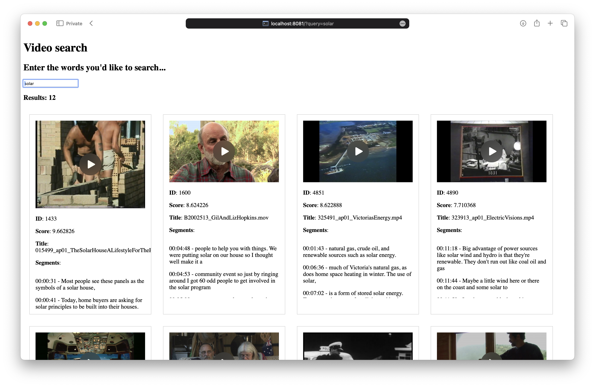

# ACMI Video search

A video search for XOS Videos that have transcriptions.




## Search

Search is handled by Elasticsearch.

### Update video search index

* Exec into your container: `docker exec -it video ash`
* Start a Python shell: `python3`
* Run these commands:

```python
from app.video import Search
search = Search()
search.index_all()
```

## Development

To run the Flask development server:

* Copy `config.tmpl.env` to `config.env`
* Add `DEBUG=true` to your `config.env`
* Run `make up`
* Visit: http://localhost:8081

To run the gunicorn server:

* Set `DEBUG=false` in your `config.env`
* Run `make up`
* Visit: http://localhost:8081

When you've finished, remove with `make down`

## Tests

To run linting and tests:

* Run `make up`
* In another terminal tab run `docker exec -it video make linttest`

## Architecture

* Production index runs on [Elastic Cloud](https://www.elastic.co/cloud)
* Re-indexing of public videos happens nightly
* ACMI website uses this index for search results: https://www.acmi.net.au/videos/
